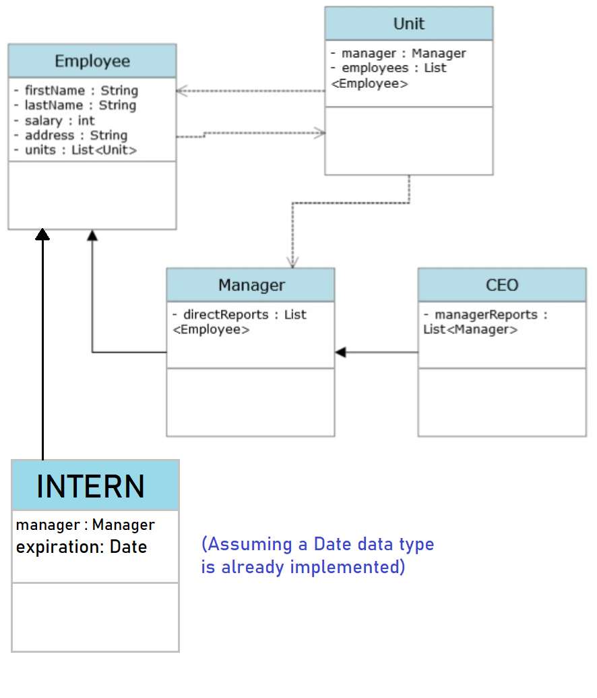

# Q1
If a class has a `private` member, the subclass inherits the member (it exists in the subclass' instance), but cannot directly access that member. `Public` members are inherited and can be directly accessed by the subclass. In grandchildren classes, the behaviour is the same (unless `protected` is used, see [Q5](#q5)). `Private` fields/methods are only accessible inside the class, while `public` fields/methods can be seen by outside classes.
# Q2
```java
// Option 1 - wrong, x and y fields are private and cannot be modified by the subclass
public void reflect() {
x = -x;
y = -y;
}
// Option 2 - wrong, same reason
public void reflect() {
this.x = -this.x;
this.y = -this.y;
}
// Option 3 - Java does not allow assignments to `this`
public void reflect() {
this = Point(-x,-y);
}
// Option 4 - correct option
public void reflect() {
double x = -this.getX();
double y =-this.getY();
this.setXY(x,y);
}
// Option 5 - wrong, same reason as #1 and #2
public void reflect() {
x = -this.getX();
y = -this.getY();
}
```
# Q3
Assuming `Point` class's `toString()` method returns a string in a ***"(x, y)"*** format, then the program will output __(0, 0)__, since the `super` (`Point`'s) constructor resets the x and y values to 0 and 0.
# Q4
Will output __(10, 10)__ since `CustomPoint`'s constructor sets the *x* and *y* values again later than `Point`'s constructor.
# Q5
```java
//Option 1 - error, Point's sum_x_y is private
public double sum_x_y() {
this.reflect();
return super.sum_x_y();
}
//Option 2 - correct option
public double sum_x_y() {
this.reflect();
return this.getX() + this.getY();
}
//Option 3 - does not override, creates a new method instead
public double custom_sum_x_y() {
this.reflect();
return super.sum_x_y();
}
//Option 4 - same as no. 3
public double custom_sum_x_y() {
this.reflect();
return this.getX() + this.getY();
}
```
# Q6
`Protected` members can be accessed within the class and its subclasses, but not by other classes. They are essentialy `private` members that can be inherited down to children classes.
# Q7
```java
public class FormulaOne extends Racecar {
    private String maker;
    public FormulaOne(int n, Driver d, String m) {
        super(n, d);
        this.maker = m;
    }
    @Override
    public String toString() {
        return super.toString() + " Maker: ";
    }
}
```
# Q9

# Q10

* `public static void main...`
* A value that has something to do with the class but does not belong to any specific instance, for example, a counter (e.g. how many instances have been created)
* A value shared by all instances (e.g. a `String` linking to a configuration file)
